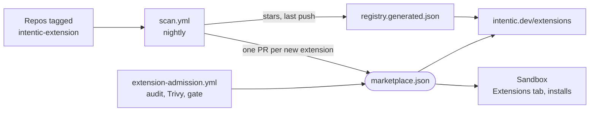

# registry

The official intentic extension registry: a git repository of commit-pinned pointers that sandboxes browse and install from and that intentic.dev renders as its extension gallery.

- `.claude-plugin/marketplace.json` is Claude Code's plugin-marketplace format plus intentic's `kind` and `trust` fields. Each entry pins a source repository and a full commit sha, the exact bytes an install clones. It changes only through reviewed pull requests.
- `.claude-plugin/registry.generated.json` holds facts read off GitHub (stars, last push, `scannedAt`). The scan commits it straight to the default branch, so a refresh never conflicts with a review.
- Discovery never lists anything: `scan.yml` runs a pinned `@intentic/registry-scan` and opens a pull request per newly tagged repository.
- `extension-admission.yml` gates every change to `marketplace.json`. It reads the candidate file through the API without checking out the pull request, audits the diff, scans the pinned source with Trivy in a job without secrets, and asks the intentic security gate about each changed sha. Extension code is never run. A pass amends the branch with the `securityReview` evidence; authors never write it themselves.
- Trust is `listed` (passed Trivy and the agent audit), `verified` (also read by a human) or `blocked`. A blocked entry stays in the file with its reason so installed sandboxes can be warned.
- The schema and the two file paths live in `@intentic/registry` in the intentic repository.

## Enabling the workflows

1. Set `REGISTRY_SCAN_VERSION` to one exact published `@intentic/registry-scan` version.
2. Install a registry GitHub App with Contents and Pull requests read/write. Put its id in `REGISTRY_APP_ID` and its private key in `REGISTRY_APP_PRIVATE_KEY`.
3. Create the gate sandbox with `sandboxes create registry-gate --definition .intentic/registry-gate.sandbox.toml`, connect its model, and store the URL of its `extension-security-gate` workflow as `INTENTIC_EXTENSION_GATE_URL`.
4. Make `extension admission / admission` a required check on the default branch and require branches to be up to date. Only the registry App may bypass it, for the nightly facts refresh.

## Key files

- [.claude-plugin/marketplace.json](.claude-plugin/marketplace.json) — the curated listing.
- [.claude-plugin/registry.generated.json](.claude-plugin/registry.generated.json) — bot-written facts per entry.
- [.github/workflows/scan.yml](.github/workflows/scan.yml) — nightly discovery and fact refresh.
- [.github/workflows/extension-admission.yml](.github/workflows/extension-admission.yml) — the admission gate for listing changes.
- [.intentic/registry-gate.sandbox.toml](.intentic/registry-gate.sandbox.toml) — definition of the sandbox that runs the security gate.
- [.intentic/config/workflows.json](.intentic/config/workflows.json) — the audit the gate runs; changes merge here first, then get pulled into that sandbox.
